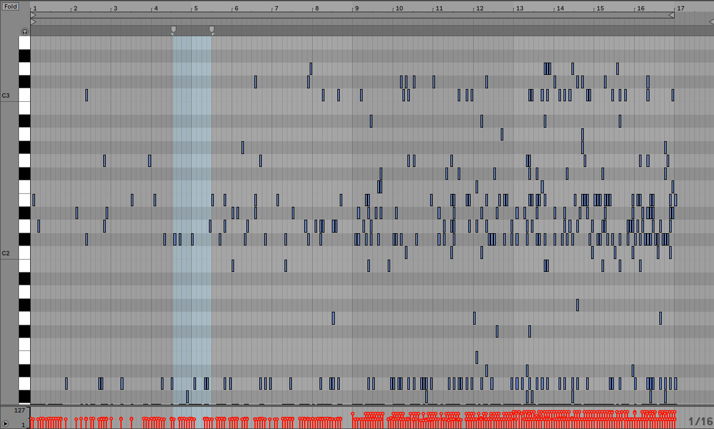

# Beat-generator

This project uses an LSTM to generate drum tracks, in a similar way to language models (a polyphonic variation of it).

## Training

The data path needs to be changed in training.py. Then the model can be trained with:

```bash
python training.py
```

Alternatively, music_rnn.pt is a pretrained model to use for generation. Here's the piano roll for a few collaged outputs from this model:



<audio src="./generated/final_arrangement.mp3" controls preload></audio>

## Generation

A midi file can be generated with:

```bash
python generation.py
```

The temperature hyperparameter can be changed inside the file. The higher the temperature, the more random the generation is. The sample generated file is available in the generated/ folder, along with its visual representation and an audio track layered with a few string chords.
